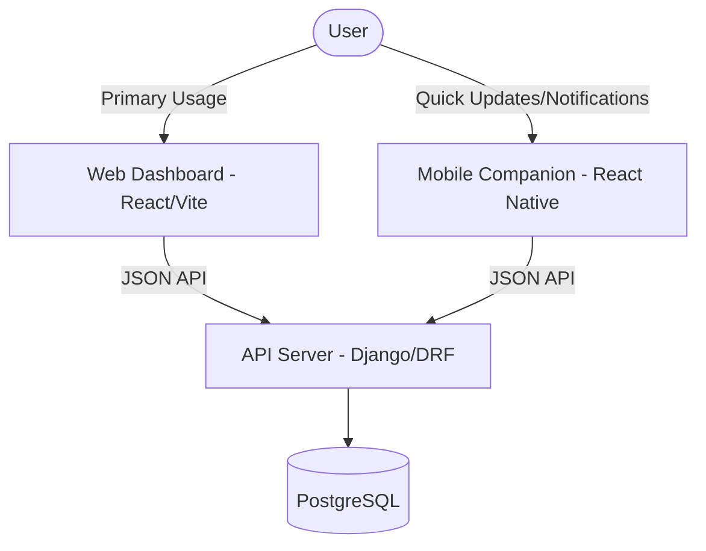

# Production Strategy & Architecture

This document outlines the production deployment strategy for JobTracker and the architectural relationship between the Web, Backend, and Mobile platforms.

## 🚀 Deployment Status

| Component | Platform | URL | Status |
| :--- | :--- | :--- | :--- |
| **Frontend (Web)** | Vercel | [https://jobtracker.kaysarulanas.me](https://jobtracker.kaysarulanas.me) | ✅ Live |
| **API (Backend)** | AWS EC2 | [https://api.jobtracker.kaysarulanas.me](https://api.jobtracker.kaysarulanas.me) | ✅ Live |
| **Database** | PostgreSQL | AWS Local | ✅ Live |

## 🏗 System Architecture

The system follows a central-hub architecture where the Django REST Framework (DRF) backend serves as the single source of truth for both Web and Mobile clients.


## 🔄 How to Update the Backend

Updating the production backend follows a simple Git-based flow:

1.  **Local**: Make changes, commit, and push to GitHub:
    ```bash
    git add .
    git commit -m "Your update message"
    git push origin main
    ```
2.  **Server (SSH)**: Pull the latest code:
    ```bash
    cd ~/Job-Application-Tracker-Full-Stack
    git pull origin main
    ```
3.  **Apply Changes**:
    - **Code only**: `sudo systemctl restart gunicorn`
    - **Database changes**: `python manage.py migrate`
    - **Visual changes**: `python manage.py collectstatic --noinput`

---

## 📱 Mobile-as-Companion Strategy

The Mobile App is designed as a **Second Layer** companion to the primary Web experience.

### Purpose & Focus
- **Web Primary**: The web version remains the primary tool for detailed job tracking, analytics, and data management.
- **Mobile Companion**: Focused on:
  - **Speed**: Quick status updates (e.g., "Interviewing" -> "Offered").
  - **Notifications**: Real-time alerts for application deadlines.
  - **Daily Usage**: Checking status on the go without requiring a full admin experience.

### Non-Goals for Mobile
- Full Administrative Panel (Web only).
- Complex Report Generation (Web only).
- Bulk Data Importing (Web only).

## 🛠 Next Steps (Roadmap)
1. **Functional Web Dashboard**: Transitioning the web frontend from mock/demo data to the production API.
2. **Data Cleanup**: Removing all hardcoded dummy data from the database and frontend.
3. **Mobile Sync**: Finalizing the "Lite" mobile dashboard to sync perfectly with the production web events.
