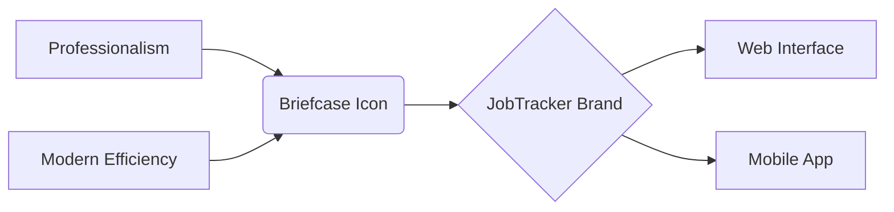
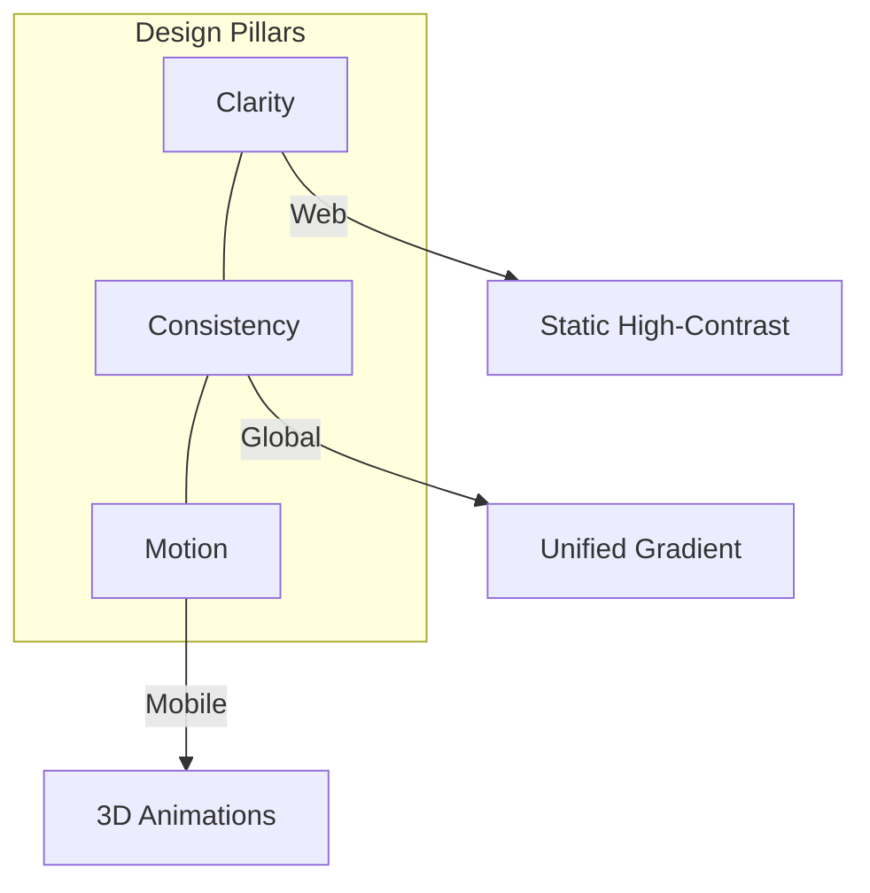

# Branding & Logo Design Report

**Developer:** Kaysarul Anas  
**Brand Identity:** JobTracker  
**Date:** February 9, 2026

---

## 1. Design Concept: "The Modern Professional"

The JobTracker logo was designed to bridge the gap between traditional professional values and modern technological efficiency.

### 1.1 The Iconography
- **The Briefcase**: Universal symbol for work and professionalism. It suggests tool-readiness and a career journey.
- **The Style**: Line-art variant (`lucide-react`) for a light, modern aesthetic.

---

## 2. Visual Language

### 2.1 Color Strategy (The Success Gradient)
The logo utilizes a vibrant gradient from **Core Blue** to **Deep Indigo**.

*   **Blue (#2563EB)**: Stability, trust, and intelligence.
*   **Indigo (#4F46E5)**: Ambition, creativity, and premium quality.

### 2.2 Branding Pillars

---

## 3. Platform-Specific Optimizations

### 3.1 Web (Static & High-Contrast)
Focus on **clarity at various scales**. Responsive styling in the Navbar (small) and Auth pages (large).

### 3.2 Mobile (Alive & Interactive)
On mobile, we introduced **Motion** as a key brand element:
- **3D Floating Animation**: Subtile Y-axis bobbing on the Welcome screen.
- **Perspective Tilt**: Native 3D rotation on X and Y axes.
- **Aura Glow**: Pulsing radial gradient for depth and "heartbeat" feel.
- **Welcome Sequence**: A 6-second immersion window to establish brand identity.

---

## 4. Logo Implementations

| Version | Context | Primary Icon | Styling |
| :--- | :--- | :--- | :--- |
| **Main Brand** | Auth Pages | Briefcase | Large Gradient Box + Shadow |
| **Navigator** | Navbar | Briefcase | Minimalist Icon + Light BG |
| **Interactive** | Mobile Welcome | Briefcase | 3D Floating + Tilt + Aura Glow |

---
> The JobTracker logo is more than an icon—it is a promise of organization and a catalyst for professional growth.
