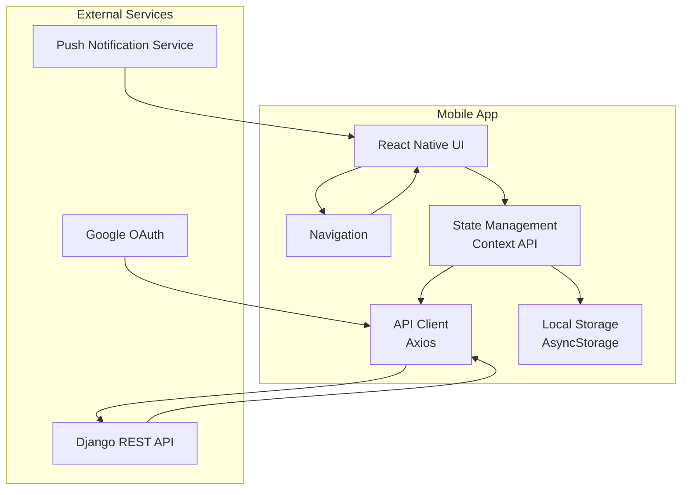
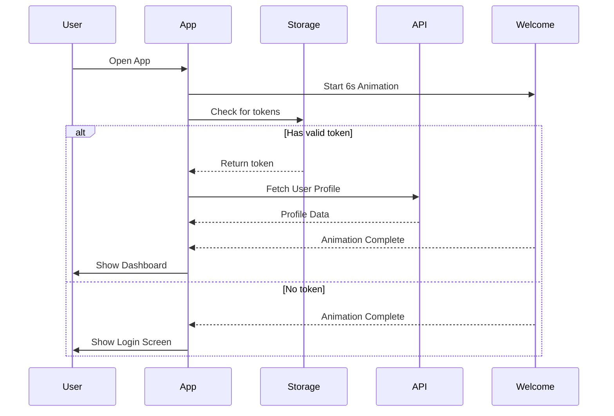
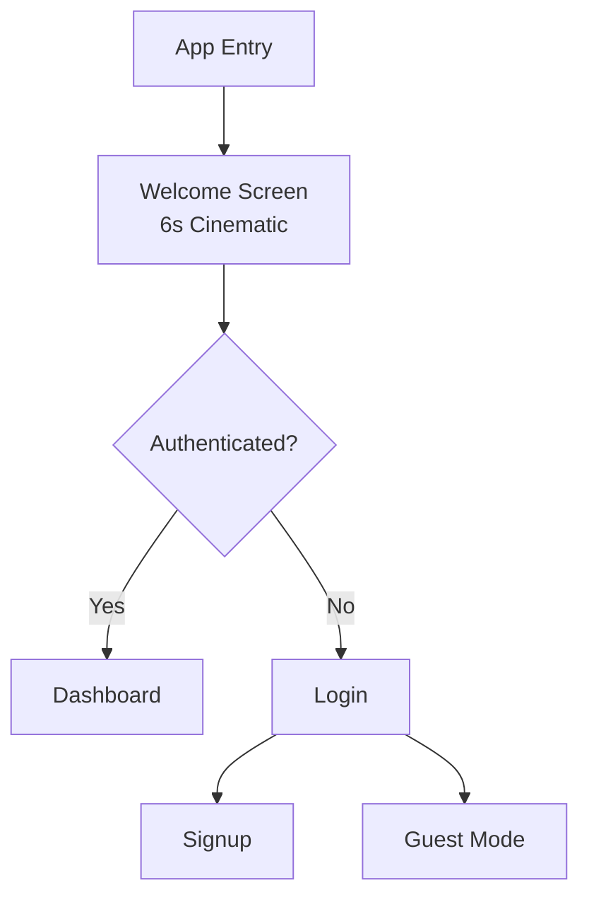
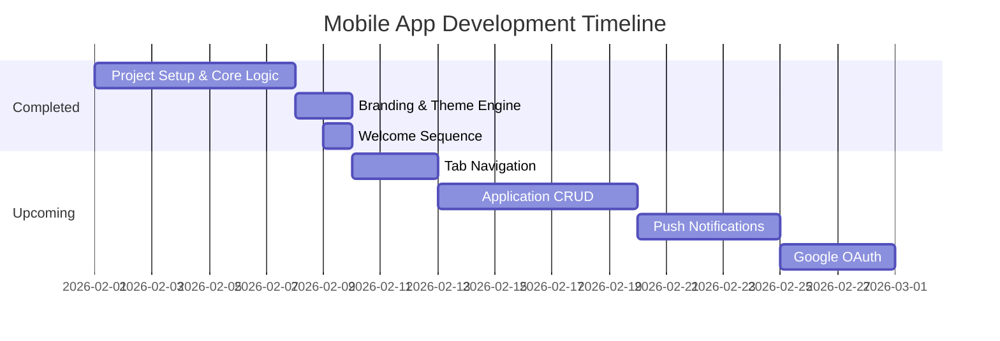

# JobTracker Mobile - Development Report

**Developer:** Kaysarul Anas  
**Technology Stack:** React Native (Expo) + Reanimated + Lucide  
**Report Date:** February 9, 2026  
**Project Status:** 🟢 UI/UX & Core Navigation Complete  

---

## 1. Executive Summary

The **JobTracker Mobile** app is the companion application to the Job Application Tracker web platform. It objective is to provide job seekers with a premium, high-performance mobile experience to track their applications on the go.

### Key Objectives
- 💎 **Modern UI**: Achieve a high-end, "wow" factor design.
- ✅ **Native Experience**: High-performance iOS and Android builds via Expo.
- ✅ **Seamless Integration**: Direct connection to Django REST API.
- ✅ **Premium UX**: Fluid 3D animations and micro-interactions.
- ✅ **Auth Security**: JWT token management and secure persistence.

---

## 2. Design Philosophy & Thought Process

### From Dark to Light (and Back)
We initially developed a premium **Dark Mode** focusing on depth. Upon aligning with the web branding, we refactored the app to support a **Theme-Driven Architecture**.
- 💡 **Light Mode**: Professional readability (`#F8FAFC` background).
- 🌑 **Dark Mode**: Tech-focused immersion (`#0F172A` background).

### Premium Elements
- **3D Animations**: Uses `react-native-reanimated` for a 3D floating briefcase on the Welcome screen.
- **Cinematic Transitions**: A 6-second Welcome sequence provides a smooth entry, fading into the auth flow once brand immersion is complete.

---

## 3. Technical Architecture

### Architecture Overview

### Authentication Sequence

---

## 4. Navigation Structure

### Navigation Hierarchy

---

## 5. Features Implemented So Far

- ✅ **Premium Welcome Sequence**: A 6-second animated intro with 3D logo effects.
- ✅ **Dynamic Theme System**: Real-time switching between modes.
- ✅ **Secure Auth Wrapper**: Integrated with Django JWT.
- ✅ **Guest Mode**: Exploration without account creation.
- ✅ **Dashboard UI**: Overview stats and job application cards.
- ✅ **Smart Redirection**: Auto-detects login state during the welcome animation.

---

## 6. Development Roadmap

---
> This report documents the mobile evolution of the JobTracker platform, showcasing advanced React Native development techniques and premium UI execution.
