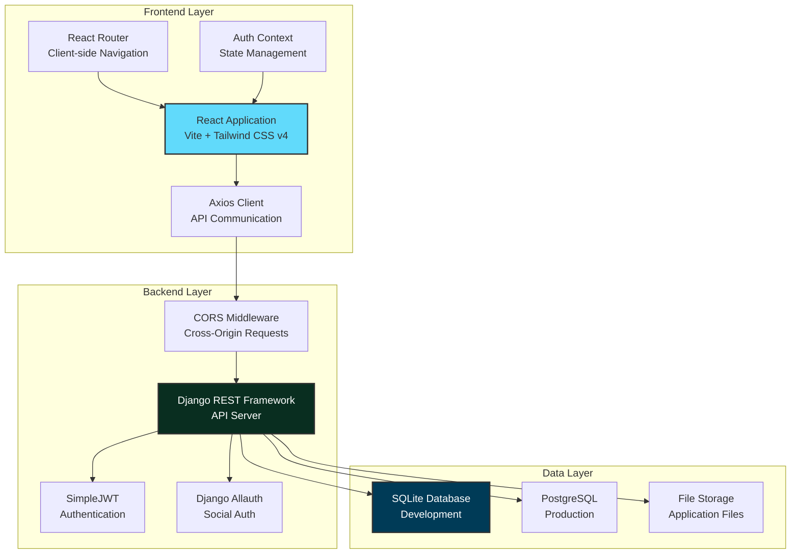
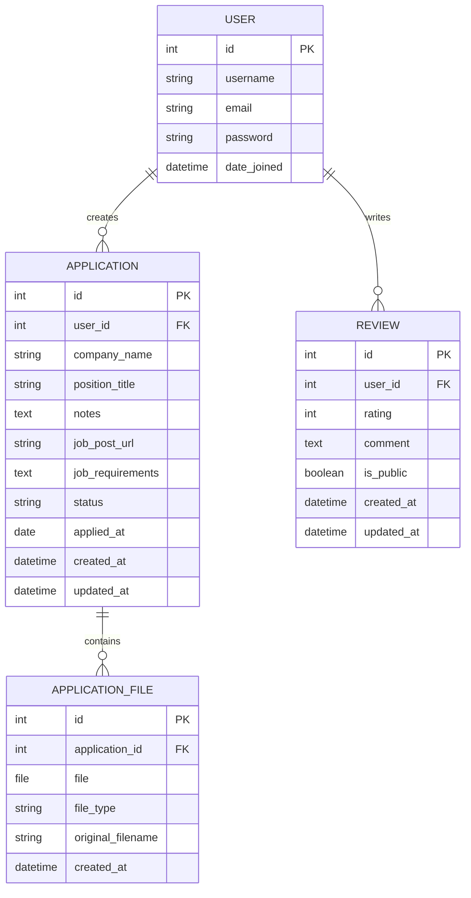

# Job Application Tracker - Project Report

**Developer:** Kaysarul Anas  
**Technology Stack:** Django REST Framework + React (Vite)  
**Report Date:** February 8, 2026  
**Project Status:** Active Development

---

## Executive Summary

I built the Job Application Tracker as a full-stack web application to help job seekers like myself organize and manage job applications efficiently. The system provides secure user authentication, comprehensive job tracking capabilities, file management for resumes and cover letters, and a modern, responsive user interface.

### What I've Accomplished
- ✅ Implemented secure JWT-based authentication with Google OAuth integration
- ✅ Built a RESTful API with Django REST Framework
- ✅ Created a modern React frontend with Tailwind CSS v4
- ✅ Ensured user-specific data isolation and security
- ✅ Developed file upload and management system
- ✅ Designed responsive dashboard with multiple view modes
- ✅ Configured production-ready deployment setup

---

## Table of Contents

1. [Problem Statement](#1-problem-statement)
2. [My Solution](#2-my-solution)
3. [System Architecture](#3-system-architecture)
4. [Backend Development](#4-backend-development)
5. [Frontend Development](#5-frontend-development)
6. [UI/UX Design](#6-uiux-design)
7. [Authentication & Security](#7-authentication--security)
8. [Database Design](#8-database-design)
9. [API Documentation](#9-api-documentation)
10. [Deployment](#10-deployment)
11. [Testing](#11-testing)

---

## 1. Problem Statement

### The Challenge I Identified

As a job seeker myself, I noticed several pain points:
- **Disorganization**: Difficulty tracking multiple applications across different companies
- **Lost Information**: Forgetting which resume version was sent where
- **Missed Follow-ups**: Losing track of application statuses and interview dates
- **Scattered Data**: Job descriptions and notes stored in various locations
- **No Analytics**: Unable to see patterns in my application success rates

### Target Users

I designed this for:
- Recent graduates entering the job market
- Career changers managing multiple applications
- Active job seekers applying to 10+ positions simultaneously
- Anyone who wants organized job search records

---

## 2. My Solution

### Core Features I Implemented

#### 🔐 **Secure Authentication**
- Email/password registration and login
- Google OAuth integration for quick access
- JWT token-based session management
- Automatic token refresh mechanism

#### 📊 **Application Tracking**
- Track company name, position, and application status
- Record application dates and deadlines
- Store job post URLs for easy reference
- Save job requirements for interview preparation
- Add personal notes and observations

#### 📁 **File Management**
- Upload multiple files per application (resumes, cover letters, portfolios)
- Track which version of documents was sent to each company
- Secure file storage with user-specific access control

#### 📈 **Dashboard & Analytics**
- Visual statistics showing application status breakdown
- Board view (Kanban-style) for organization
- List view for detailed information display
- Search and filter capabilities
- Demo mode for exploring features without login

#### ⭐ **User Feedback System**
- Submit reviews and ratings
- Public testimonials for homepage
- Moderation system for review approval

---

## 3. System Architecture

### High-Level Architecture



### Technology Stack I Chose

| Layer | Technology | Why I Chose It |
|-------|-----------|----------------|
| **Frontend** | React 19.2 | Modern, component-based UI |
| | Vite 7.2 | Fast dev server and builds |
| | Tailwind CSS v4 | Rapid styling with utilities |
| | React Router v7 | Robust client-side routing |
| | Axios | Clean API integration |
| **Backend** | Django 5.2 | Batteries-included framework |
| | Django REST Framework 3.16 | Powerful API toolkit |
| | SimpleJWT 5.5 | Industry-standard auth |
| | Django Allauth 65.14 | Easy social auth |
| **Database** | SQLite | Simple for development |
| | PostgreSQL | Scalable for production |
| **DevOps** | Gunicorn | Production WSGI server |
| | WhiteNoise | Efficient static files |
| | Docker | Containerization |

---

## 4. Backend Development

### 4.1 My Backend Setup

I built the backend with **Django 5.2** and **Django REST Framework 3.16** for a robust, scalable API.

#### Dependencies I Used

```python
# requirements.txt
Django==5.2.11
djangorestframework==3.16.1
djangorestframework_simplejwt==5.5.1
django-allauth==65.14.0
django-cors-headers==4.9.0
dj-rest-auth==7.0.2
gunicorn==23.0.0
psycopg2-binary==2.9.10
dj-database-url==2.3.0
whitenoise==6.9.0
python-dotenv==1.2.1
```

### 4.2 Database Models I Created

#### Application Model

The core model for tracking job applications:

```python
from django.db import models
from django.contrib.auth import get_user_model

User = get_user_model()

class Application(models.Model):
    # Status choices
    APPLIED = 'Applied'
    INTERVIEW = 'Interview'
    OFFER = 'Offer'
    REJECTED = 'Rejected'

    STATUS_CHOICES = [
        (APPLIED, 'Applied'),
        (INTERVIEW, 'Interview'),
        (OFFER, 'Offer'),
        (REJECTED, 'Rejected'),
    ]

    # Relationships
    user = models.ForeignKey(
        User,
        on_delete=models.CASCADE,
        related_name="applications"
    )

    # Core fields
    company_name = models.CharField(max_length=255)
    position_title = models.CharField(max_length=255)
    notes = models.TextField(blank=True, null=True)
    
    # Job details
    job_post_url = models.URLField(blank=True, null=True)
    job_requirements = models.TextField(blank=True, null=True)
    
    # Status tracking
    status = models.CharField(
        max_length=50,
        choices=STATUS_CHOICES,
        default=APPLIED
    )
    applied_at = models.DateField(blank=True, null=True)
    
    # Timestamps
    created_at = models.DateTimeField(auto_now_add=True)
    updated_at = models.DateTimeField(auto_now=True)

    def __str__(self):
        return f"{self.company_name} - {self.position_title}"
```

**My Design Decisions:**
- ✅ User foreign key ensures data isolation
- ✅ Status choices provide consistent data
- ✅ Timestamps track creation and updates
- ✅ Optional fields allow flexibility

#### ApplicationFile Model

I created this to handle multiple file uploads per application:

```python
class ApplicationFile(models.Model):
    application = models.ForeignKey(
        Application,
        on_delete=models.CASCADE,
        related_name="files"
    )
    
    file = models.FileField(upload_to="application_files/")
    file_type = models.CharField(max_length=50)
    original_filename = models.CharField(max_length=255)
    
    created_at = models.DateTimeField(auto_now_add=True)

    def __str__(self):
        return self.original_filename
```

#### Review Model

For user feedback and testimonials:

```python
class Review(models.Model):
    user = models.ForeignKey(
        User,
        on_delete=models.CASCADE,
        related_name="reviews"
    )
    rating = models.IntegerField(default=5)  # 1-5 stars
    comment = models.TextField()
    is_public = models.BooleanField(default=False)  # For moderation
    
    created_at = models.DateTimeField(auto_now_add=True)
    updated_at = models.DateTimeField(auto_now=True)

    def __str__(self):
        return f"Review by {self.user.username} - {self.rating} stars"
```

### 4.3 Database Relationships



### 4.4 API Views I Implemented

I used ViewSets for clean CRUD operations:

#### ApplicationViewSet

```python
from rest_framework import viewsets, permissions

class ApplicationViewSet(viewsets.ModelViewSet):
    serializer_class = ApplicationSerializer
    permission_classes = [permissions.IsAuthenticated]

    def get_queryset(self):
        # Only return applications belonging to current user
        return self.request.user.applications.all()

    def perform_create(self, serializer):
        # Automatically set user to current logged-in user
        serializer.save(user=self.request.user)
```

**Security Features I Added:**
- ✅ Authentication required
- ✅ User-specific data filtering
- ✅ Automatic user assignment
- ✅ No cross-user data access

---

## 5. Frontend Development

### 5.1 My Frontend Stack

I chose modern React ecosystem tools for optimal developer experience:

```json
{
  "dependencies": {
    "react": "^19.2.0",
    "react-dom": "^19.2.0",
    "react-router-dom": "^7.13.0",
    "axios": "^1.13.4",
    "@react-oauth/google": "^0.13.4",
    "lucide-react": "^0.563.0"
  },
  "devDependencies": {
    "vite": "^7.2.4",
    "tailwindcss": "^4.1.18",
    "@tailwindcss/vite": "^4.1.18",
    "@vitejs/plugin-react": "^5.1.1",
    "eslint": "^9.39.1"
  }
}
```

### 5.2 Component Architecture

I organized my components into:

```
src/
├── components/
│   ├── AuthLayout.jsx        # Auth page wrapper
│   ├── Navbar.jsx            # Navigation
│   ├── Footer.jsx            # Footer
│   ├── LandingHero.jsx       # Homepage hero
│   ├── Features.jsx          # Feature showcase
│   ├── Testimonials.jsx      # User reviews
│   └── dashcomp/             # Dashboard components
│       ├── DashboardHeader.jsx
│       ├── StatsSection.jsx
│       ├── BoardView.jsx
│       ├── ListView.jsx
│       ├── ApplicationCard.jsx
│       ├── SearchControls.jsx
│       └── ReviewForm.jsx
├── context/
│   └── AuthContext.jsx       # Authentication state
├── pages/
│   ├── HomePage.jsx
│   ├── LoginPage.jsx
│   ├── SignupPage.jsx
│   └── Dashboard/
│       └── DashBoard.jsx
└── api/
    └── axios.js              # API client
```

### 5.3 API Integration

I configured Axios with interceptors for automatic token management:

```javascript
// src/api/axios.js
import axios from 'axios';

const api = axios.create({
  baseURL: import.meta.env.VITE_API_URL || 'http://127.0.0.1:8000/',
  headers: {
    'Content-Type': 'application/json',
  },
});

// Request interceptor: Attach JWT token
api.interceptors.request.use(
  (config) => {
    const authEndpoints = ['/api/auth/token/', '/api/auth/registration/'];
    const isAuthEndpoint = authEndpoints.some(endpoint => 
      config.url.includes(endpoint)
    );
    
    if (!isAuthEndpoint) {
      const token = localStorage.getItem('access_token');
      if (token) {
        config.headers.Authorization = `Bearer ${token}`;
      }
    }
    
    return config;
  },
  (error) => Promise.reject(error)
);

export default api;
```

---

## 6. UI/UX Design

### 6.1 My Design Philosophy

I focused on:

1. **Minimalism**: Clean, uncluttered interfaces
2. **Responsiveness**: Mobile-first design approach
3. **Accessibility**: Semantic HTML and ARIA labels
4. **Performance**: Optimized assets and lazy loading
5. **Consistency**: Unified color scheme and typography

### 6.2 Design System

I use Tailwind CSS v4 with custom configuration:

```css
/* src/index.css */
@import "tailwindcss";

@theme {
  --font-sans: Inter, -apple-system, BlinkMacSystemFont, "Segoe UI", sans-serif;
}

body {
  @apply font-sans;
}
```

**Color Usage:**
- **Primary**: Blue tones for CTAs and interactive elements
- **Success**: Green for positive actions (Offer status)
- **Warning**: Yellow/Orange for pending states (Interview)
- **Danger**: Red for rejections and destructive actions
- **Neutral**: Gray scale for text and backgrounds

---

## 7. Authentication & Security

### 7.1 My Authentication Implementation

I implemented a dual-authentication system:

1. **Email/Password**: Traditional credentials-based auth
2. **Google OAuth**: Social authentication for convenience

### 7.2 Security Measures I Added

#### Token Management

**Access Token:**
- Lifetime: 60 minutes
- Storage: localStorage
- Usage: Attached to all API requests

**Refresh Token:**
- Lifetime: 1 day
- Storage: localStorage
- Usage: Obtain new access token when expired

#### Data Isolation

Every API endpoint I created implements user-based filtering:

```python
def get_queryset(self):
    return self.request.user.applications.all()
```

This ensures users can only access their own data.

### 7.3 Challenges I Overcame

During development, I encountered and resolved several issues:

#### Challenge 1: Registration Failures
**Problem**: Backend rejected valid registration data  
**Solution**: Added `password2` field for confirmation

#### Challenge 2: Google OAuth 500 Errors
**Problem**: Django Sites framework misconfiguration  
**Solution**: Corrected `SITE_ID` and linked Social Application

#### Challenge 3: 401 Unauthorized Loop
**Problem**: Axios interceptor attached tokens to login requests  
**Solution**: Excluded auth endpoints from token attachment

---

## 8. Database Design

### 8.1 Schema Overview

My database consists of 4 main tables:

1. **User** (Django built-in)
2. **Application** (Custom)
3. **ApplicationFile** (Custom)
4. **Review** (Custom)

### 8.2 Migrations

I use Django's migration system:

```bash
# Create migrations
python manage.py makemigrations

# Apply migrations
python manage.py migrate
```

---

## 9. API Documentation

### 9.1 Base URL

- **Development**: `http://127.0.0.1:8000/`
- **Production**: `https://your-domain.com/`

### 9.2 Authentication Endpoints

#### POST /api/auth/token/
Obtain JWT access and refresh tokens.

**Request:**
```json
{
  "email": "user@example.com",
  "password": "securepassword"
}
```

**Response:**
```json
{
  "access": "eyJ0eXAiOiJKV1QiLCJhbGc...",
  "refresh": "eyJ0eXAiOiJKV1QiLCJhbGc..."
}
```

### 9.3 Application Endpoints

#### GET /api/applications/
List all applications for authenticated user.

#### POST /api/applications/
Create new application.

**Request:**
```json
{
  "company_name": "Microsoft",
  "position_title": "Frontend Developer",
  "status": "Applied",
  "applied_at": "2026-02-08",
  "notes": "Applied through LinkedIn"
}
```

#### PUT /api/applications/{id}/
Update application.

#### DELETE /api/applications/{id}/
Delete application.

---

## 10. Deployment

### 10.1 Development Setup

#### Backend
```bash
cd backend
python3 -m venv venv
source venv/bin/activate
pip install -r requirements.txt
python manage.py migrate
python manage.py runserver
```

#### Frontend
```bash
cd frontend
npm install
npm run dev
```

### 10.2 Environment Variables

#### Backend (.env)
```bash
SECRET_KEY=your-secret-key
DEBUG=True
ALLOWED_HOSTS=localhost,127.0.0.1
CORS_ALLOWED_ORIGINS=http://localhost:5173
```

#### Frontend (.env)
```bash
VITE_API_URL=http://127.0.0.1:8000/
VITE_GOOGLE_CLIENT_ID=your-google-client-id
```

---

## 11. Testing

### 11.1 Testing Approach

I plan to implement:

- [ ] Unit tests for all models
- [ ] API endpoint tests
- [ ] Authentication flow tests
- [ ] Component unit tests
- [ ] Integration tests
- [ ] E2E tests with Playwright

### 11.2 Example Test

```python
# applications/tests.py
from django.test import TestCase
from .models import Application

class ApplicationModelTest(TestCase):
    def test_create_application(self):
        app = Application.objects.create(
            user=self.user,
            company_name='Test Corp',
            position_title='Developer',
            status='Applied'
        )
        self.assertEqual(str(app), 'Test Corp - Developer')
```

---

## Conclusion

### What I've Accomplished

I successfully built a full-stack job application tracker that demonstrates:

✅ **Full-stack Development**
- Modern React frontend with Tailwind CSS v4
- Robust Django REST Framework backend
- Secure JWT authentication with OAuth integration

✅ **Software Engineering Best Practices**
- RESTful API design
- Component-based architecture
- Database normalization
- Security-first approach

✅ **User-Centric Design**
- Intuitive dashboard interface
- Responsive mobile design
- Demo mode for exploration

### Technical Skills I Demonstrated

**Backend:**
- Django ORM and migrations
- DRF serializers and viewsets
- JWT authentication
- Social OAuth integration
- File upload handling

**Frontend:**
- React hooks and context
- React Router navigation
- Axios interceptors
- Tailwind CSS styling
- Component composition

**DevOps:**
- Docker containerization
- Environment configuration
- Static file serving
- CORS configuration

---

*This project is part of my portfolio demonstrating full-stack development capabilities.*
